<p align="center">
  
</p>

<p align="center">
  <a href="https://aatreyeemukherjee.vercel.app"></a>
  <a href="https://www.linkedin.com/in/aatreyee-mukherjee-8253ab216/"></a>
  <a href="mailto:aatreyee257@gmail.com"></a>
</p>

I used to write Terraform for IBM Cloud. Now I'm doing a Master of IT at Monash, building RAG pipelines for assistive tech, and making small Chrome extensions at midnight when I should be studying.

Open to **2027 internships** in software, cloud, data and security.

---

### 📦 `terraform state list`

<details>
<summary><b>module.infraalign</b>: drift detection for Terraform, in Go</summary>
<br>

A Go CLI that compares your Terraform code against live AWS infrastructure, flags drift, sends Slack alerts and can auto-remediate.

`Go` `Terraform` `AWS` → [repo](https://github.com/aatreyee257/InfraAlign)
</details>

<details>
<summary><b>module.rag_eval</b>: local RAG evaluation for assistive-tech research</summary>
<br>

A fully local retrieval pipeline built for the Monash Assistive Technology team, used to evaluate how well RAG setups answer research questions.

`Python` `LangChain` `Ollama` `ChromaDB`
</details>

<details>
<summary><b>module.portfolio</b>: my site, with a terminal hero and a live InfraAlign demo</summary>
<br>

Next.js site on Vercel. The hero types out Terraform, and you can run an InfraAlign drift check right in the browser.

`Next.js` `TypeScript` `Tailwind` → [visit](https://aatreyeemukherjee.vercel.app) · [repo](https://github.com/aatreyee257/portfolio)
</details>

---

### 🚧 `terraform apply` in progress: Melbourne Data Warehouse

An analytics pipeline on Victorian public data.

- [x] Scope the project
- [ ] Python ingestion
- [ ] DuckDB + dbt star-schema warehouse
- [ ] SQL analysis
- [ ] Dashboard

---

### 🧸 Small fun builds

- **[Don't Get Distracted](https://github.com/aatreyee257/do-not-disturb)**: a Chrome extension that blocks distracting sites during focus sessions and makes you type a guilt sentence to quit early. Built with Claude.
- *Mood Weather: coming soon. Type how you feel and a little cloud reacts.*

---

### 🧰 Stack

```hcl
locals {
  languages = ["Go", "Python", "SQL", "JavaScript"]
  cloud     = ["Terraform", "AWS", "IBM Cloud"]
  ai        = ["LangChain", "Ollama", "ChromaDB"]
  data      = ["Pandas", "DuckDB", "dbt"]
  learning  = "AWS Solutions Architect – Associate"
}
```
